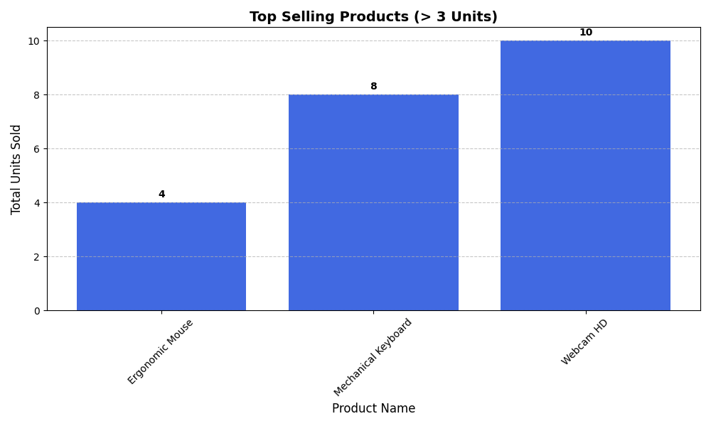

# E-Commerce-Relational-Analytics
Developed a relational database to track sales performance, identify high-value "whale" customers, and visualize revenue trends.

# 🛒 E-Commerce Intelligence Pipeline
**Project Overview:** A Python-based analytics engine that transforms raw transactional data into actionable business insights using a relational SQLite database.

## 🚀 Key Achievements
* **Engineered a Relational Schema:** Designed a 4-table database system (Categories, Products, Sales, Customers) with enforced referential integrity.
* **Complex Data Extraction:** Developed multi-join SQL queries to bridge disparate tables and calculate real-time business metrics.
* **Growth Analytics:** Implemented time-series analysis to visualize daily revenue trends and identify sales seasonality.

## 📊 Business Insights Generated
* **High-Value Customers:** Identified "Whale" customers using a monetary spend analysis (The "Whales" report).
* **Inventory Performance:** Automated a "Top-Sellers" report to highlight products moving > 3 units per week.
* **Category Dominance:** Mapped revenue by department, identifying Electronics as the primary growth driver.

## 🛠️ Tech Stack
* **Language:** Python 3.12
* **Database:** SQLite3
* **Libraries:** Pandas (ETL), Matplotlib (Data Viz)

# 🛒 E-Commerce Analytics & Automation Pipeline

## 📌 Project Overview
I built a full-cycle data system that moves from **Raw Data** to **Business Action**. This project manages a retail database, performs deep-dive sales analysis, and includes an automated monitoring system to prevent stockouts.

## 🛠️ Tech Stack
* **Database:** SQLite (Relational Schema Design)
* **Language:** Python (Data Orchestration)
* **Libraries:** Pandas (Analysis), Matplotlib (Visualization)

## 💡 Key Features
* **Relational Database Design:** Engineered a 4-table schema (Sales, Products, Customers, Categories) with full referential integrity.
* **The "Whale" Report:** Identified top-tier customers by joining multi-table data to calculate lifetime spend.
* **Proactive Automation:** Built a background monitoring loop that alerts management when high-velocity products need reordering.

  
